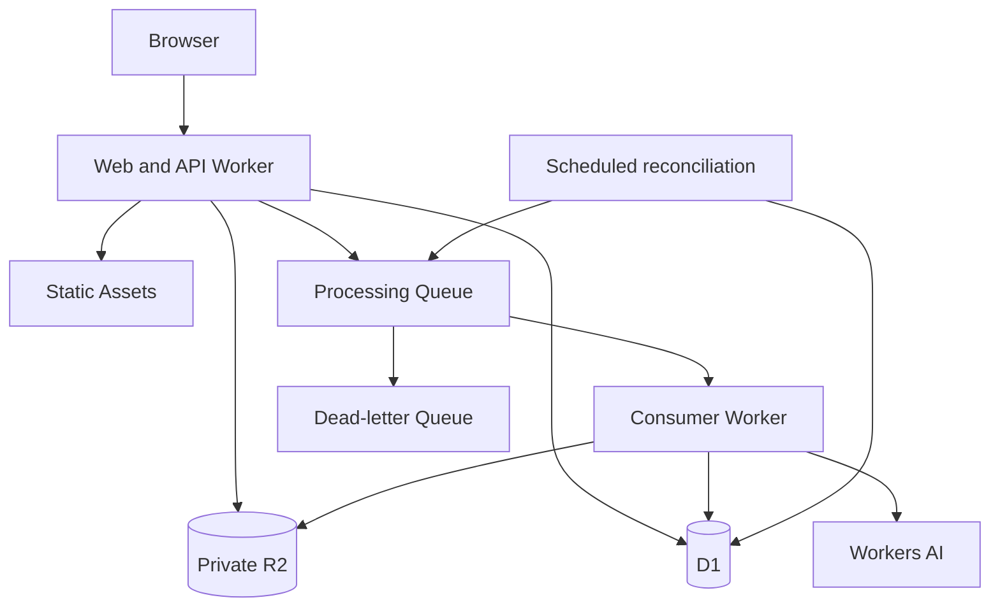
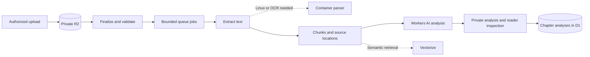

# Cloudflare architecture proposal

Status: design proposal, 2026-10-04. Product documentation checked during drafting. No resources provisioned; account eligibility, model quality, plan limits, and budget must be verified during implementation.

## Start small

Use a modular TypeScript application: one web/API Worker and one background consumer Worker. Frontend: Next.js App Router conventions, deployed on Workers through the proposed vinext runtime, with Workers Static Assets. vinext reimplements Next.js APIs on Vite; it is not the stock Next.js runtime. Verify required framework features before scaffolding. This follows the current [Cloudflare Next.js guide](https://developers.cloudflare.com/workers/framework-guides/web-apps/nextjs/). Keep business logic in domain modules so deployment boundaries can evolve independently.

| Component | Responsibility | When |
| --- | --- | --- |
| Workers + Static Assets | UI, API, authorization, submissions | First slice |
| D1 | Users, curriculum, attempts, reviews, job state | First slice |
| R2, private buckets | Private PDFs, extracted chapter text, analysis artifacts | First slice |
| Queues | Buffer chapter-analysis requests and processing bursts | First slice |
| Workers AI | Chapter explanations, principle extraction, grounded discussion | First slice, gated by extraction and quality evaluation |
| Workflows | Durable orchestration when ingestion needs multiple long-running steps | Deferred; start with bounded queue jobs |
| Vectorize + Workers AI embeddings | Custom retrieval with edition and location provenance | When curated retrieval becomes insufficient |
| Containers | Parsing/OCR dependencies requiring Linux | Only after profiling actual documents |
| Durable Objects / Agents SDK | Live shared state or genuinely stateful agent interactions | Deferred pending a concrete need |

Cloudflare supplies [static asset hosting](https://developers.cloudflare.com/workers/static-assets/), [SQL storage with D1](https://developers.cloudflare.com/d1/), [object storage with R2](https://developers.cloudflare.com/r2/), and [model inference with Workers AI](https://developers.cloudflare.com/workers-ai/). These capabilities fit the proposed separation; this is a design choice, not a claim that all components are necessary from day one.

## Core reading flow

An authenticated upload creates a private source record and R2 object. Finalization queues a bounded extraction job that preserves PDF-page locators and proposes chapter boundaries. Keep step state in D1; split work into independently retryable bounded jobs where needed. The reader confirms or corrects the outline. A selected chapter is queued for analysis; the consumer loads authorized chunks, calls Workers AI, validates citations, and stores a versioned result. Chapter discussion uses that chapter and explicitly selected context, bounded to the chosen model context window. Long chapters require chunk-level analysis followed by a grounded synthesis; never assume an entire book fits in one prompt.

Separate ingestion state (`uploaded`, `extracting`, `outline_ready`, `needs_review`, `failed`) from chapter analysis state (`pending`, `queued`, `analyzing`, `ready`, `failed`). Retrying one chapter must not reprocess the whole book. Key analyses by source version, chapter version, prompt version, and model. Editing boundaries invalidates affected results and clearly marks old discussions as based on the previous version.

## Asynchronous job and optional exercise-review flow



An analysis job or submitted attempt and an outbox record are written together using an atomic D1 batch. After commit, the Worker tries to dispatch the job. A scheduled reconciliation pass republishes undispatched outbox records. Queue messages carry IDs and versions, not document bodies. The browser polls authorized status endpoints initially.

[Queues delivers at least once and does not guarantee ordering](https://developers.cloudflare.com/queues/reference/delivery-guarantees/). Consumers therefore claim jobs using conditional updates and a lease, deduplicate by job ID plus input and analysis version, and persist results under a unique key. Retry with bounded backoff, then route exhausted messages to a dead-letter queue. Persist the result before acknowledgment. An expired lease allows recovery; a stale worker cannot overwrite a newer result. A crash around inference can still cause repeated model calls and cost, even when the final result is deduplicated.

There is no cross-service transaction between D1, R2, Queues, and an AI call. Use explicit state transitions, idempotent writes, and reconciliation for partial failures.

## Data model sketch

- `users`, `sessions`: identity, roles, session expiry.
- `principles`: saved concepts linked to chapter citations.
- `tracks`, `track_items`, `track_progress`: ordered references to chapters/principles and learner progress.
- `labs`, `lab_versions`, `rubric_versions`: immutable published learning material.
- `attempts`, `attempt_revisions`: learner-owned submissions tied to lesson versions.
- `reviews`: rubric results, supporting evidence, prompt/model version, usage, status.
- `skill_evidence`: links from attempts to demonstrated principles; revisable estimates.
- `books`, `chapters`, `chapter_versions`: ordered chapter boundaries, extraction quality, user corrections.
- `chapter_analyses`, `reading_progress`, `notes`, `discussion_messages`: owner-scoped reading and understanding.
- `sources`, `source_versions`: owner, visibility, edition, checksum, permission record, status.
- `source_chunks`: location and R2 key, plus future embedding identifiers.
- `citations`: lesson/review claim linked to a source version and locator.
- `jobs`, `outbox`, `usage_events`: durable processing and cost attribution.

Use server-derived ownership on every private query, foreign keys, uniqueness constraints, and indexes on user/time, publication status, and job status. Keep book bodies and large artifacts out of D1. Watch database growth and query behavior against [D1 limits](https://developers.cloudflare.com/d1/platform/limits/); do not assume infinite capacity in a single database. Begin with one database per environment; revisit partitioning based on evidence.

## Core book ingestion and chapter analysis



Begin with one processing queue and explicit D1 job states for extraction and chapter analysis. Add [Workflows](https://developers.cloudflare.com/workflows/) if measured ingestion needs durable orchestration across long-running steps. If added, it owns the ingestion state machine; avoid two independent retry owners for the same step. [Containers](https://developers.cloudflare.com/containers/) is a conditional runtime for dependencies outside Workers, not a baseline service.

For retrieval, begin with explicitly attached source passages. Later choose [Vectorize](https://developers.cloudflare.com/vectorize/) when we need control over chunks, access scope, and citation provenance. Evaluate managed AI Search as an alternative at that point rather than maintaining both retrieval systems.

## Identity and boundaries

Proposed developer-facing pilot login: GitHub OAuth with sessions stored in D1 and secure, HttpOnly cookies. GitHub is an external identity dependency; app compute, persistence, and inference remain on Cloudflare. Confirm this interpretation of “entirely Cloudflare” before implementing login. Cloudflare Access is an alternative for an invitation-only pilot.

The Worker authorizes all API and download requests. Private files have no public bucket endpoint. Upload grants must be short-lived and scoped to a server-created object key, with size/type verification before processing. Cross-user access is rejected before retrieval and rechecked before presenting citations. Escape rendered source content; treat retrieved text as data, never as tool instructions. Model output cannot publish lessons, change permissions, or execute code.

The first version accepts explanations and test plans, with optional local exercise code. Hosted execution of learner or generated code is deferred and would require a separate isolated execution design, resource limits, restricted egress, and no production credentials.

## Reliability, cost, and deployment

Separate development, staging, and production resources. Commit migrations and deployment configuration once the implementation starts. Store credentials only in secrets bindings. Exercise queue retries, cross-user access, and restore procedures before a public launch. Database rollback does not restore R2 objects or external side effects; keep source versions and a documented reconciliation procedure.

Track request/job IDs, queue age, dead letters, inference failures, usage per review, D1 query load, and storage growth. Redact uploaded content and credentials from logs. Set upload limits, per-user review quotas, model token limits, and concurrency caps. Save completed versioned analyses so retries and repeated views do not regenerate them unnecessarily.

No monthly price is promised yet. Estimate it from measured reviews per learner, tokens per review, pages processed, retained storage, and optional container runtime; use current product pricing before launch. Evaluate candidate Workers AI models on factual grounding, useful feedback, latency, and cost before pinning one.

## Keep the codebase simple

One repository and package, one Next.js-style web application, one background Worker, one D1 database and one private R2 bucket per environment. Use thin routes and ordinary feature folders; a large package hierarchy or Nx workspace is unnecessary for the first version.

```text
src/app/             Next.js routes and layouts
src/features/        library, chapters, tracks, notebook
src/server/          authorization, D1 queries, R2 access, AI calls
workers/jobs/        bounded extraction and analysis handlers
migrations/          D1 schema changes
docs/                product and architecture decisions
```

The data model above includes future concepts. Implement only users/sessions, books/source versions, chapters, analyses, notes, tracks/items/progress, and durable job records for the first slice. Exercise rubrics, skill graphs, editorial publishing, and cross-book retrieval come later.
