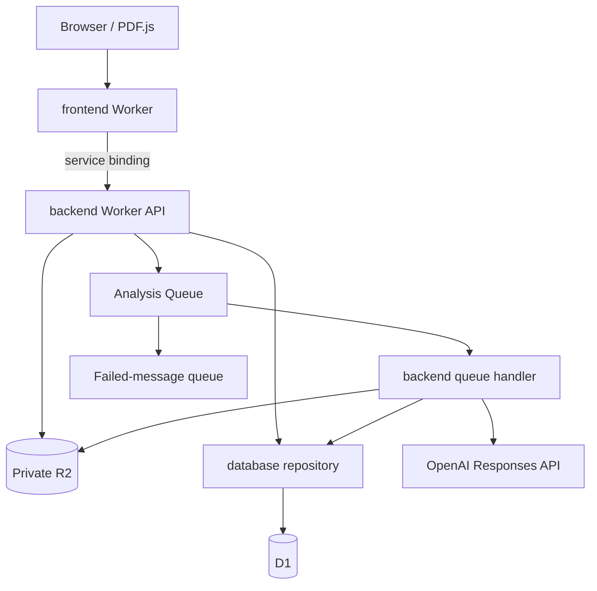

# Architecture

Updated 2026-10-04. The local foundation is implemented. Hosted authentication, provisioning, and deployment remain future work.

## Nx boundaries

| Project    | Owns                                                           | Allowed dependencies                             |
| ---------- | -------------------------------------------------------------- | ------------------------------------------------ |
| `frontend` | Next.js-style routes, React interface, browser PDF extraction  | Shared contracts; backend HTTP/service interface |
| `backend`  | API use cases, validation, R2 files, OpenAI, asynchronous jobs | Shared contracts; database repository            |
| `database` | D1 queries, atomic batches, schema, migrations                 | Shared types and D1 binding                      |

The frontend's route handler forwards to a Cloudflare service binding. It never imports the database repository. The backend instantiates that repository with its D1 binding; all SQL stays in the database project. Both API and queue handlers run in the same backend Worker. There is no extra analysis service to operate.

Framework: vinext 1.x implements the Next.js API surface on Vite. It is not the stock Next.js runtime. The App Router, React client interface, route handlers, and Cloudflare service binding are verified locally. See [Cloudflare Next.js guidance](https://developers.cloudflare.com/workers/framework-guides/web-apps/nextjs/).

## Local runtime

The Cloudflare Vite plugin runs both Workers with workerd/Miniflare. D1, R2, and Queues are simulated locally with persistence under `.wrangler/state/`. Remote bindings are disabled. Root Wrangler configurations define the services and a placeholder local database ID; they are not production deployment configs.

OpenAI is the one external runtime dependency in this version, explicitly selected for the local build. `.env` supplies the key/model to server environments; there are no public-prefixed secret variables. Requests use the Responses API with structured output and `store: false`. Model choice is configurable. See [OpenAI Structured Outputs](https://developers.openai.com/api/docs/guides/structured-outputs).

## PDF and chapter flow

1. Browser PDF.js extracts page text and proposes chapters from bookmarks or chapter headings. A fallback groups pages and labels them as page ranges.
2. The backend validates bounded JSON metadata, declared file size, page order, and chapter ranges. Extracted pages go to R2; a D1 batch stages book and chapter records.
3. A separate binary request streams the PDF into R2 through a fixed-length stream, checking its signature and exact byte count without buffering the entire file in Worker memory. Only completed uploads appear in the library. The browser deletes staged records after upload failures; closing the browser mid-upload can leave hidden staging data until manually removed. Failed database creation triggers object cleanup.
4. The reader checks/corrects the chapter outline before starting analysis.
5. Analysis creates a unique job for a chapter/version and publishes its ID to the queue. The job record also acts as a dispatch outbox.
6. The consumer atomically claims work with a lease token, retrieves that chapter's pages from R2, and requests a structured analysis.
7. Returned evidence excerpts must occur on the cited source pages. Invalid output is not saved as a successful analysis.
8. An atomic D1 batch writes the result and marks the job ready, conditional on the worker still holding the lease.
9. The UI polls status; results, notes, and saved principles remain available after reloads and restarts.

PDF extraction is client-side to keep the first runtime simple. Before supporting untrusted multi-user uploads, decide whether server-side re-extraction is necessary to establish that submitted text corresponds to the uploaded PDF. Scans and diagrams are not OCR'd; users can open the original PDF.

## Data ownership

- `books`, `chapters`: source object references, page ranges, order, version.
- `jobs`, `analyses`: state, dispatch marker, lease token/expiry, model, token usage, result.
- `notes`: one editable private note per chapter.
- `tracks`, `track_items`: saved principles, provenance, insertion order, applied status.

Foreign keys cascade deletion of a book through chapters, jobs, analyses, notes, and saved principles. Default learning tracks are seeded by the first migration. Full book text lives in R2 rather than D1.

## Failure behavior

[Queues provides at-least-once delivery](https://developers.cloudflare.com/queues/reference/delivery-guarantees/). Unique chapter/version jobs prevent duplicate result rows. Conditional lease claims prevent concurrent publication, and stale workers cannot replace a newer result. An uncertain external AI call may still be billed more than once after recovery; no exactly-once billing guarantee is claimed.

Provider/validation errors produce a visible failed job and require explicit retry. Transport failures can retry at the queue layer. The scheduled handler reconciles undispatched jobs and marks expired leases as failed. Cron triggers must be invoked manually in local development; the chapter's recovery control can requeue an expired job. Already completed jobs are reused rather than regenerated.

There is no D1/R2/Queue cross-service transaction. R2 deletion precedes deleting the D1 source record so a partial deletion remains retryable. In-flight jobs can only publish while their job row still exists. A full production reconciliation/backup process is future work.

## Access and limits

This prototype accepts only localhost requests. Mutations require a same-origin header. The development server binds to 127.0.0.1. These are local-development guards, not authentication or a multi-user authorization system. Never expose this build through a public tunnel.

Limits: 100 MB PDFs, 600 pages, 3 million extracted characters per book, 30,000 per page, 65,000 per analyzed chapter, 100 chapter ranges, 20,000-character notes, and bounded model output. The UI states when a request sends chapter text to OpenAI. No AI call happens automatically on upload.

## Later Cloudflare capabilities

- Workers AI: alternative inference adapter if model evaluation supports switching.
- Workflows: durable orchestration if document processing becomes multi-step and long-running.
- Containers: server-side parsing/OCR when dependencies require Linux.
- Vectorize: access-aware cross-book retrieval once direct chapter context is insufficient.
- Authentication and per-user ownership: required before hosting.

These capabilities have not been provisioned. Keep the initial app small and add each for a demonstrated requirement.
